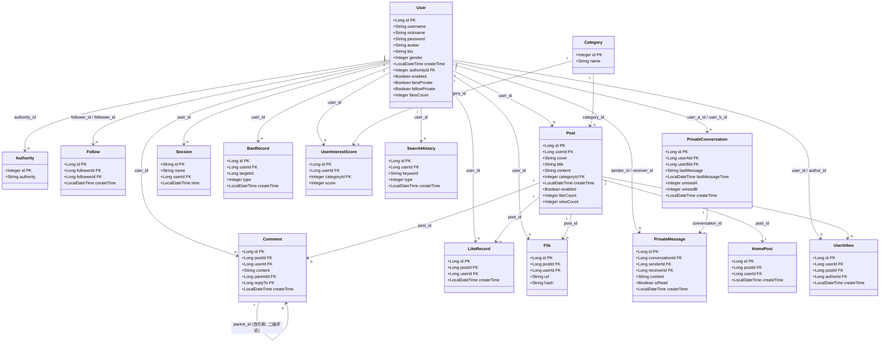

# Y社区 - 社交平台

基于 Spring Boot 3 的社交平台后端，提供帖子发布、用户互动、私信聊天、AI 助手等功能。

## 技术栈

| 类别 | 技术 | 版本 |
|---|---|---|
| 语言 | Java | 21 |
| 框架 | Spring Boot | 3.4.12 |
| 安全 | Spring Security + JWT (jjwt) | 0.9.1 |
| ORM | MyBatis-Plus | 3.5.15 |
| 数据库 | MySQL | 8.0.46 |
| 缓存 | Redis | 6.0.16 |
| 搜索 | Elasticsearch | 9.2.0 |
| 文档数据库 | MongoDB | 8.0.16 |
| AI 大模型 | LangChain4j + 阿里云 DashScope (通义千问 Plus) | 1.3.0-beta9 |
| API 文档 | Knife4j (OpenAPI 3) | 4.6.0 |
| JSON | Alibaba Fastjson2 | 2.0.15 |

## 功能特性

- **用户系统** — 注册、登录（JWT 双 Token）、个人信息管理、每日签到
- **帖子系统** — 发布/删除帖子、基于兴趣的个性化推荐、关注流、分类浏览
- **社交互动** — 关注/取关、点赞、两级评论、互关好友列表
- **搜索** — Elasticsearch 全文检索帖子和用户、搜索历史记录
- **私信** — 用户间一对一聊天、会话列表、未读消息计数
- **AI 助手** — 基于通义千问的智能对话，支持流式响应（SSE），聊天记忆持久化到 MongoDB
- **内容审核** — 管理员封禁用户、审核员封禁帖子/删除评论
- **文件上传** — 图片上传（SHA-256 去重）、头像上传，支持 jpg/png/gif/webp

## 系统架构

```
┌─────────────┐     ┌─────────────┐     ┌──────────────┐
│   MySQL     │     │    Redis    │     │ Elasticsearch│
│ 持久化存储   │     │  缓存/排行榜  │     │  全文搜索     │
└──────┬──────┘     └──────┬──────┘     └──────┬───────┘
       │                   │                    │
       └───────────┬───────┘────────────────────┘
                   │
          ┌────────┴────────┐
          │  Spring Boot 3  │
          │  SocialPlatform │
          └────────┬────────┘
                   │
          ┌────────┴────────┐
          │     MongoDB     │
          │  AI 聊天记忆     │
          └─────────────────┘
```

**核心设计模式：**
- **Cache-Aside + 异步持久化** — 高频写操作（点赞、关注）先写 Redis，再通过 `@Async` 异步落库 MySQL
- **游标分页** — 信息流使用 Redis ZSet 实现基于时间戳的游标分页（`ScrollResult`）
- **无状态认证** — JWT Token + Redis 黑名单机制，Access Token 有效期 1 天，Refresh Token 有效期 7 天
- **RBAC 权限** — 三种角色：普通用户（USER）、管理员（ADMIN）、审核员（REVIEWER）

## 数据库设计



**关系说明：**

| 关系 | 类型 | 说明 |
|---|---|---|
| User → Authority | N:1 | 多个用户共享一个权限角色 |
| User ↔ User (Follow) | M:N | 通过 `follow` 表实现关注/粉丝关系 |
| User → Post | 1:N | 一个用户可以发布多个帖子 |
| Post → Category | N:1 | 帖子属于一个分类 |
| Post → Comment | 1:N | 帖子下有多条评论 |
| Comment → Comment | 自引用 | `parent_id` 实现二级评论（楼中楼） |
| Post → LikeRecord | 1:N | 帖子的点赞记录 |
| User → PrivateConversation | 1:N | 用户参与多个私信会话 |
| PrivateConversation → PrivateMessage | 1:N | 会话包含多条消息 |
| Post → HomePost | 1:1 | 帖子推送到首页 |
| User → UserInbox | 1:N | 用户收件箱接收关注者的帖子推送 |
| User → UserInterestScore | 1:N | 用户对多个分类有兴趣评分 |

## API 接口

| 模块 | 路径前缀 | 功能 |
|---|---|---|
| 用户 | `/user` | 登录、注册、个人信息、签到、搜索 |
| 帖子 | `/post` | 发布、删除、信息流、分类筛选 |
| 评论 | `/comment` | 发表评论/回复、获取评论列表 |
| 关注 | `/follow` | 关注/取关、粉丝/关注列表、互关好友 |
| 点赞 | `/like` | 点赞/取消点赞 |
| 分类 | `/category` | 获取帖子分类 |
| 文件 | `/upload` | 上传/删除图片、头像 |
| 私信 | `/message` | 发消息、会话列表、未读计数 |
| 管理员 | `/admin` | 封禁用户、设置审核员、数据统计 |
| 审核员 | `/reviewer` | 封禁帖子、删除评论 |
| AI 对话 | `/chat` | 智能助手流式对话 |
| AI 会话 | `/session` | 会话创建、查询、删除 |

完整 API 文档可通过 Knife4j 访问：`http://localhost:8081/doc.html`

## 环境要求

### 依赖服务

| 服务 | 版本 | 端口 | 用途 |
|---|---|---|---|
| MySQL | 8.0.46 | 3306 | 数据库 `social_platform` |
| Redis | 6.0.16 | 6379 | 缓存（DB 1） |
| Elasticsearch | 9.2.0 | 9200 | 全文搜索（需安装 IK 分词插件） |
| MongoDB | 8.0.16 | 27017 | AI 聊天记忆（DB `chat_memory_db`） |
| Nginx | - | 8080 | 静态文件服务（图片访问） |

### 环境变量

```bash
# MySQL / Redis / JWT 共用密码
PASSWORD=your_password

# 阿里云 DashScope API Key（通义千问）
DASH_SCOPE_API_KEY=your_api_key

# Nginx 静态图片目录（上传图片存储路径）
IMAGE_PATH=/usr/local/nginx/html/imgs

# 跨域允许来源（可选，默认 http://127.0.0.1:5173）
# CORS_ORIGIN=http://127.0.0.1:5173
```

## 快速启动

### 方式一：本地运行

```bash
# 1. 克隆项目
git clone https://github.com/<your-username>/SocialPlatform.git
cd SocialPlatform

# 2. 导入数据库
mysql -u root -p social_platform < src/main/resources/social_platform.sql

# 3. 设置环境变量
export PASSWORD=your_password
export DASH_SCOPE_API_KEY=your_api_key
export IMAGE_PATH=/path/to/nginx/imgs

# 4. 启动应用
./mvnw spring-boot:run
```

### 方式二：Docker Compose

```bash
# 1. 创建 .env 文件
cp .env.example .env
# 编辑 .env 填入实际值

# 2. 创建外部卷（首次运行）
docker volume create sp-mysql-data
docker volume create sp-redis-data
docker volume create sp-es-data
docker volume create sp-es-config
docker volume create sp-es-ik-config
docker volume create sp-mongodb-data
docker volume create sp-nginx-config
docker volume create sp-nginx-html

# 3. 启动所有服务
docker compose up -d

# 4. 导入数据库（首次运行）
docker compose exec sp-mysql mysql -uroot -p${PASSWORD} social_platform < /docker-entrypoint-initdb.d/init.sql
```

启动后访问：
- 应用：`http://localhost:8081`
- API 文档：`http://localhost:8081/doc.html`
- Kibana：`http://localhost:5601`

## 开发

### 常用命令

```bash
./mvnw compile                    # 编译
./mvnw package                    # 打包 JAR
./mvnw spring-boot:run            # 启动（端口 8081）
./mvnw test                       # 运行全部测试
./mvnw test -Dtest=ClassName      # 运行单个测试类
./mvnw test -Dtest=ClassName#method  # 运行单个测试方法
```

### 项目结构

```
src/main/java/com/li/socialplatform/
├── assistant/           # LangChain4j AI 助手接口
├── bean/                # 消息 Bean
├── common/
│   ├── annotation/      # 自定义注解（@RateLimit）
│   ├── aspect/          # AOP 切面
│   ├── constant/        # 常量（Redis Key、错误消息、权限）
│   ├── exception/       # 业务异常
│   ├── properties/      # 系统配置常量
│   └── utils/           # 工具类（JWT、缓存、异步任务等）
├── config/              # 配置类（安全、Redis、MyBatis、WebSocket）
├── filter/              # JWT 认证过滤器
├── handler/             # 全局异常处理、认证处理器
├── pojo/
│   ├── dto/             # 请求 DTO
│   ├── entity/          # 数据库实体 + 响应包装
│   └── vo/              # 响应视图对象
├── server/
│   ├── controller/      # REST 控制器
│   ├── mapper/          # MyBatis-Plus Mapper
│   ├── repository/      # Elasticsearch Repository
│   ├── service/         # 服务接口
│   ├── service/impl/    # 服务实现
│   └── task/            # 定时任务
└── store/               # MongoDB 聊天记忆存储
```

## 许可证

MIT
