# Social Platform 数据库类图

```mermaid
classDiagram
    direction TB

    class User {
        +Long id PK
        +String username
        +String nickname
        +String password
        +String avatar
        +String bio
        +Integer gender
        +LocalDateTime createTime
        +Integer authorityId FK
        +Boolean enabled
        +Boolean fansPrivate
        +Boolean followPrivate
        +Integer fansCount
    }

    class Authority {
        +Integer id PK
        +String authority
    }

    class Follow {
        +Long id PK
        +Long followerId FK
        +Long followeeId FK
        +LocalDateTime createTime
    }

    class Category {
        +Integer id PK
        +String name
    }

    class Post {
        +Long id PK
        +Long userId FK
        +String cover
        +String title
        +String content
        +Integer categoryId FK
        +LocalDateTime createTime
        +Boolean enabled
        +Integer likeCount
        +Integer viewCount
    }

    class Comment {
        +Long id PK
        +Long postId FK
        +Long userId FK
        +String content
        +Long parentId FK
        +Long replyTo FK
        +LocalDateTime createTime
    }

    class LikeRecord {
        +Long id PK
        +Long postId FK
        +Long userId FK
        +LocalDateTime createTime
    }

    class Session {
        +String id PK
        +String name
        +Long userId FK
        +LocalDateTime time
    }

    class BanRecord {
        +Long id PK
        +Long userId FK
        +Long targetId
        +Integer type
        +LocalDateTime createTime
    }

    class UserInterestScore {
        +Long id PK
        +Long userId FK
        +Integer categoryId FK
        +Integer score
    }

    class File {
        +Long id PK
        +Long postId FK
        +Long userId FK
        +String url
        +String hash
    }

    class SearchHistory {
        +Long id PK
        +Long userId FK
        +String keyword
        +Integer type
        +LocalDateTime createTime
    }

    class PrivateConversation {
        +Long id PK
        +Long userAId FK
        +Long userBId FK
        +String lastMessage
        +LocalDateTime lastMessageTime
        +Integer unreadA
        +Integer unreadB
        +LocalDateTime createTime
    }

    class PrivateMessage {
        +Long id PK
        +Long conversationId FK
        +Long senderId FK
        +Long receiverId FK
        +String content
        +Boolean isRead
        +LocalDateTime createTime
    }

    class HomePost {
        +Long id PK
        +Long postId FK
        +Long userId FK
        +LocalDateTime createTime
    }

    class UserInbox {
        +Long id PK
        +Long userId FK
        +Long postId FK
        +Long authorId FK
        +LocalDateTime createTime
    }

    %% ===== 关系 =====

    User "1" --> "N" Authority : authority_id
    User "1" --> "N" Follow : follower_id (关注者)
    User "1" --> "N" Follow : followee_id (被关注者)
    User "1" --> "N" Post : user_id
    User "1" --> "N" Comment : user_id
    User "1" --> "N" LikeRecord : user_id
    User "1" --> "N" Session : user_id
    User "1" --> "N" BanRecord : user_id (执行者)
    User "1" --> "N" UserInterestScore : user_id
    User "1" --> "N" File : user_id
    User "1" --> "N" SearchHistory : user_id
    User "1" --> "N" PrivateConversation : user_a_id / user_b_id
    User "1" --> "N" PrivateMessage : sender_id / receiver_id
    User "1" --> "N" UserInbox : user_id / author_id

    Category "1" --> "N" Post : category_id
    Category "1" --> "N" UserInterestScore : category_id

    Post "1" --> "N" Comment : post_id
    Post "1" --> "N" LikeRecord : post_id
    Post "1" --> "N" File : post_id
    Post "1" --> "1" HomePost : post_id
    Post "1" --> "N" UserInbox : post_id

    Comment "1" --> "N" Comment : parent_id (自引用, 二级评论)

    PrivateConversation "1" --> "N" PrivateMessage : conversation_id
```

## 关系说明

| 关系 | 类型 | 说明 |
|---|---|---|
| User → Authority | N:1 | 多个用户共享一个权限角色 |
| User ↔ User (Follow) | M:N | 通过 `follow` 表实现关注/粉丝关系 |
| User → Post | 1:N | 一个用户可以发布多个帖子 |
| Post → Category | N:1 | 帖子属于一个分类 |
| Post → Comment | 1:N | 帖子下有多条评论 |
| Comment → Comment | 自引用 | `parent_id` 实现二级评论（楼中楼） |
| Post → LikeRecord | 1:N | 帖子的点赞记录 |
| User → PrivateConversation | 1:N | 用户参与多个私信会话 |
| PrivateConversation → PrivateMessage | 1:N | 会话包含多条消息 |
| Post → HomePost | 1:1 | 帖子推送到首页 |
| User → UserInbox | 1:N | 用户收件箱接收关注者的帖子推送 |
| User → UserInterestScore | 1:N | 用户对多个分类有兴趣评分 |
